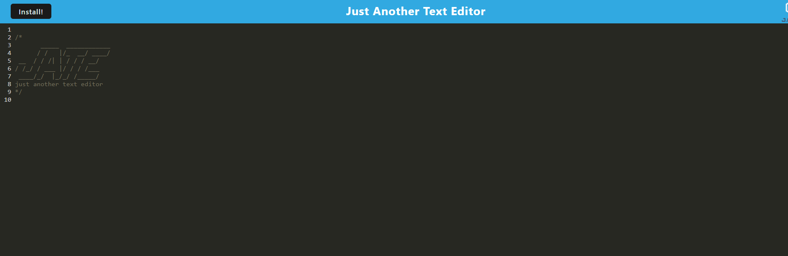

  # Text Editor PWA

## Live Link
[hosted on heroku](https://floating-dusk-50634.herokuapp.com/)

## Badges

## Description

A simple PWA that lets you save lines of text whether you have an online connection or not.

## Table of Contents

- [Badges](#Badges)
- [Installation](#installation)
- [Usage](#usage)
- [Credits](#credits)
- [License](#license)
- [Tests](#tests)

## Installation

Click the 'Install' button in the top left of the website and hit install on the prompt.

## Usage

Type whatever you want in the text editor. Click outside of the editor and your text will be saved.

## Credits

- [powe0186](https://github.com/powe0186)

## License

### MIT

    MIT License:
    A short and simple permissive license with conditions only requiring preservation
    of copyright and license notices. Licensed works, modifications, and larger works
    may be distributed under different terms and without source code.

[CLICK FOR MORE ABOUT LICENSE](https://choosealicense.com/licenses/mit/)

## Tests

## My Github & Email

- [https://github.com/powe0186](https://github.com/powe0186)
- [powe0186@gmail.com](mailto:powe0186@gmail.com)

